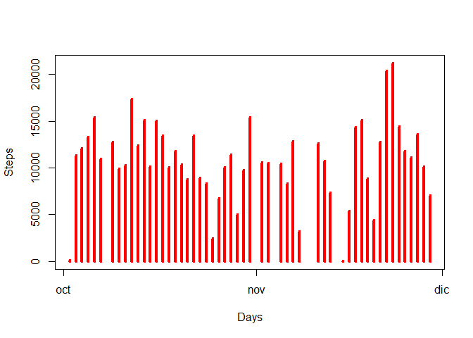
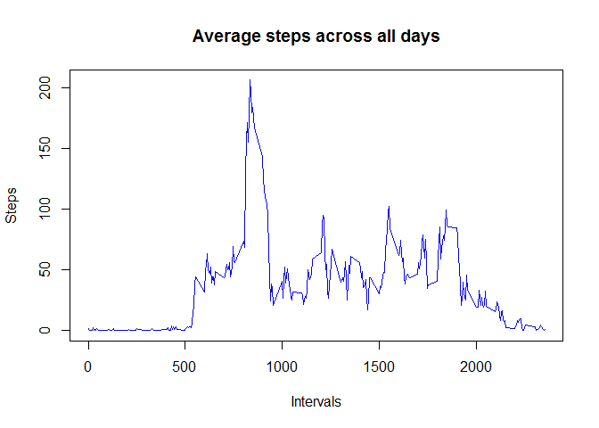
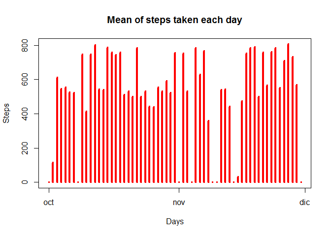
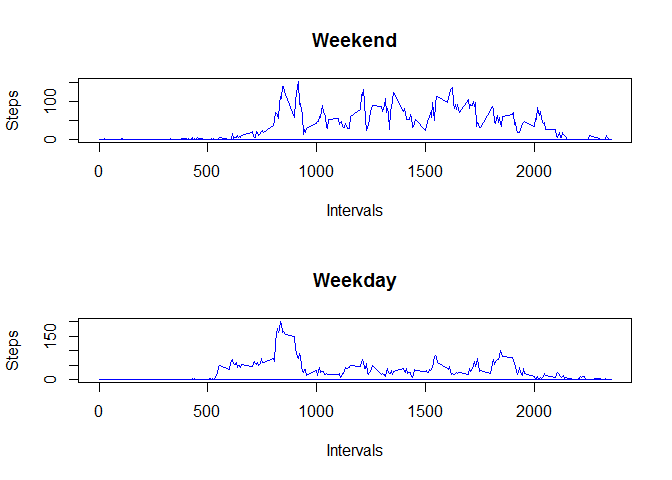

# Reproducible Research: Peer Assessment 1
Jhessica Kanda  


## Loading and preprocessing the data

Remove NA values first:


```r
        data_file <- read.csv("activity.csv", colClasses = "character", na.strings="NA");
        cc <- complete.cases(data_file[1]);
        data <- data_file[cc,];
        head(data, 10);
```

```
##     steps       date interval
## 289     0 2012-10-02        0
## 290     0 2012-10-02        5
## 291     0 2012-10-02       10
## 292     0 2012-10-02       15
## 293     0 2012-10-02       20
## 294     0 2012-10-02       25
## 295     0 2012-10-02       30
## 296     0 2012-10-02       35
## 297     0 2012-10-02       40
## 298     0 2012-10-02       45
```


## What is mean total number of steps taken per day?

1) Total number of steps taken each day


```r
    vsteps <- c()
    vdate <- unique(data$date)
    
    for(i in 1:length(vdate)) {
        dsub <- subset(data, date==vdate[i]);
        value <- sum(as.numeric(dsub$steps));
        vsteps[i] <- value;
    }
    
    date_final <- strptime(vdate, format="%Y-%m-%d");
    final_data_1 <- data.frame(vsteps, date_final, stringsAsFactors = FALSE);

    plot(strptime(final_data_1[,2], format="%Y-%m-%d"), as.numeric(final_data_1[,1]), type = "h", xlab="Days", ylab="Steps", col="red", lwd = 4);    
```

 

2) Calculate and report the **mean** and **median** total number of steps taken per day


```r
    vmean <- mean(vsteps);
    print(paste("Mean: ", vmean));
```

```
## [1] "Mean:  10766.1886792453"
```


```r
    vmedian <- median(vsteps);
    print(paste("Median: ", vmedian));
```

```
## [1] "Median:  10765"
```


## What is the average daily activity pattern?

1) Average steps by interval 


```r
    vmean <- c()
    vinterval <- unique(data$interval);
    
    for(i in 1:length(vinterval)) {
        dsub <- subset(data, interval==vinterval[i]);
        value <- mean(as.numeric(dsub$steps));
        vmean[i] <- value;
    }
    
    names <- c("steps", "interval");
    final_data_2 <- data.frame(vmean, vinterval, stringsAsFactors = FALSE);
    colnames(final_data_2) <- names;

    plot(as.numeric(final_data_2[,2]), as.numeric(final_data_2[,1]), type = "l", xlab="Intervals", ylab="Steps", main = "Average steps across all days", col="blue");    
```

 

2) The interval that contains the maximum number of steps is:


```r
    max_steps <- max(as.numeric(final_data_2$steps));
    max_interval <- subset(final_data_2, steps==max_steps);
    print(paste("Interval max number steps: ", max_interval$interval));
```

```
## [1] "Interval max number steps:  835"
```

## Imputing missing values

1) Number of missing values in the data set


```r
    nas <- nrow(data_file) - nrow(data);
    print(paste("Number of NAs: ", nas));
```

```
## [1] "Number of NAs:  2304"
```

2) We are going to fill in the missing values of the date set with the mean value of the steps for that specific day. If the mean value for that day is NA, it will be replaced by 0(zero).

3)

    3.1 First calculate the value of mean steps per each day and save it in a vector:


```r
getMeanStepsPerDay <- function() {
    data_all <- read.csv("activity.csv", colClasses = "character", na.strings="NA");
    cc <- complete.cases(data_all[1]);
    data_mean <- data_all[cc,];
        
    vdays <- unique(data_all$date);
    vmeanSteps <- c();
    
    for(i in 1:length(vdays)) {
        dsub <- subset(data_mean, date==vdays[i]);
        value <- mean(as.numeric(dsub$steps));
        vmeanSteps[i] <- as.numeric(value);
        
        if(is.nan(vmeanSteps[i])) {
            vmeanSteps[i] = 0;
        }
    }
    return (vmeanSteps)
}
```


    3.2 Now replace the missing values in the data set, by the mean of that day:
    

```r
    data_all <- read.csv("activity.csv", colClasses = "character", na.strings="NA");
    v_mean <- getMeanStepsPerDay();
    vdaysAll <- unique(data_all$date);
    
    for(n in 1:length(vdaysAll)) {
        data_days <- data_all[data_all[,2] == vdaysAll[n], ];
        data_days[is.na(data_days$steps), 1] <- round(v_mean[n], digits = 3);
        if(n == 1) {
            data_final <- data.frame(data_days);
        }
        if(n != 1) {
            data_final <- rbind(data_final, data_days);
        }
    }
    print(head(data_final, 30));
```

```
##    steps       date interval
## 1      0 2012-10-01        0
## 2      0 2012-10-01        5
## 3      0 2012-10-01       10
## 4      0 2012-10-01       15
## 5      0 2012-10-01       20
## 6      0 2012-10-01       25
## 7      0 2012-10-01       30
## 8      0 2012-10-01       35
## 9      0 2012-10-01       40
## 10     0 2012-10-01       45
## 11     0 2012-10-01       50
## 12     0 2012-10-01       55
## 13     0 2012-10-01      100
## 14     0 2012-10-01      105
## 15     0 2012-10-01      110
## 16     0 2012-10-01      115
## 17     0 2012-10-01      120
## 18     0 2012-10-01      125
## 19     0 2012-10-01      130
## 20     0 2012-10-01      135
## 21     0 2012-10-01      140
## 22     0 2012-10-01      145
## 23     0 2012-10-01      150
## 24     0 2012-10-01      155
## 25     0 2012-10-01      200
## 26     0 2012-10-01      205
## 27     0 2012-10-01      210
## 28     0 2012-10-01      215
## 29     0 2012-10-01      220
## 30     0 2012-10-01      225
```

4) The histogram differs when NA's are filled in.


```r
    plot(strptime(data_final[,2], format="%Y-%m-%d"), as.numeric(data_final[,1]), type = "h", xlab="Days", ylab="Steps", main="Mean of steps taken each day",col="red", lwd = 4);    
```

 


## Are there differences in activity patterns between weekdays and weekends?


```r
    Sys.setlocale("LC_TIME", "English");
```

```
## [1] "English_United States.1252"
```

```r
    dates <- as.POSIXct(strptime(data_final$date, "%Y-%m-%d"));
    
    day <- c()
    for(n in 1:length(dates)) {
        d <- weekdays(dates[n]);
        
        if (d == "Saturday" || d == "Sunday") {
            day[n] <- "Weekend";    
        } else {
            day[n] <- "Weekday";    
        }
        
    }
    
    data_final_4 <- cbind(data_final, day);
    data_weekday <- subset(data_final_4, day == "Weekday");
    data_weekend <- subset(data_final_4, day == "Weekend");
    
    v_mean_weekday <- c()
    v_mean_weekend <- c()

    for (m in 1: length(vinterval)) {
        a <- subset(data_weekday, interval == vinterval[m]) 
        v_mean_weekday[m] <- round(mean(as.numeric(a$steps)), 3)
        
        b <- subset(data_weekend, interval == vinterval[m])
        v_mean_weekend[m] <- round(mean(as.numeric(b$steps)), 3)
    }    
    
    data_weekday <- cbind(data_weekday, v_mean_weekday)
    data_weekend <- cbind(data_weekend, v_mean_weekend)
    
    par(mfrow= c(2,1));
    
    plot(as.numeric(data_weekend$interval), as.numeric(data_weekend$v_mean_weekend), type = "l", xlab="Intervals", ylab="Steps", col="blue", main = "Weekend");    
    
    plot(as.numeric(data_weekday$interval), as.numeric(data_weekday$v_mean_weekday), type = "l", xlab="Intervals", ylab="Steps", col="blue", main = "Weekday");    
```

 
